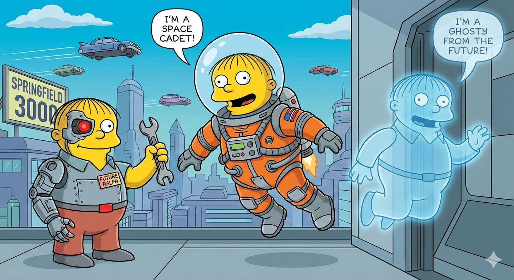

# Future-Ralph



**A Heterogeneous Agent Wrapper exploring multiple possible futures.**

Future-Ralph is a developer tool that explores multiple possible futures of a codebase using heterogeneous AI agents. Inspired by the non-canonical future timelines of Ralph Wiggum in The Simpsons, the tool treats each agent run as a distinct possible future.

## Vision

Rather than retrying the same agent repeatedly, Future-Ralph embraces diversity of models, tools, and reasoning styles to reduce correlated failure modes and escape local minima. The user remains in the present, while Future-Ralph explores futures asynchronously and returns with the best viable outcome.

## Core Features (v1)

*   **Heterogeneous Agents:** Support for OpenCode, Gemini, Cursor, Claude, Codex.
*   **Future Exploration:** Iterative exploration of futures (serial execution).
*   **Safety:** Wrapper-enforced safety, budgets, and timeouts.
*   **Async-First:** Detach and resume capabilities.
*   **Treehouse of Horror:** Optional exploration of extreme/unsafe futures (never auto-applied).

## Installation

```bash
uv tool install future-ralph
```

## Usage

```bash
future-ralph run "Refactor the login logic"
```

See documentation for more details.
